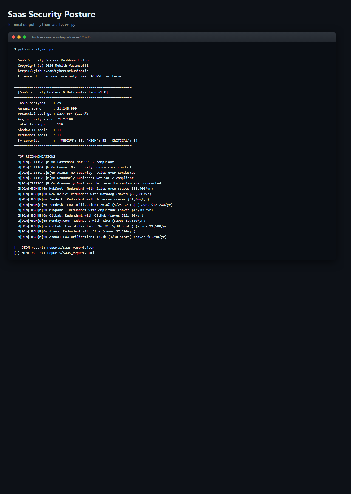
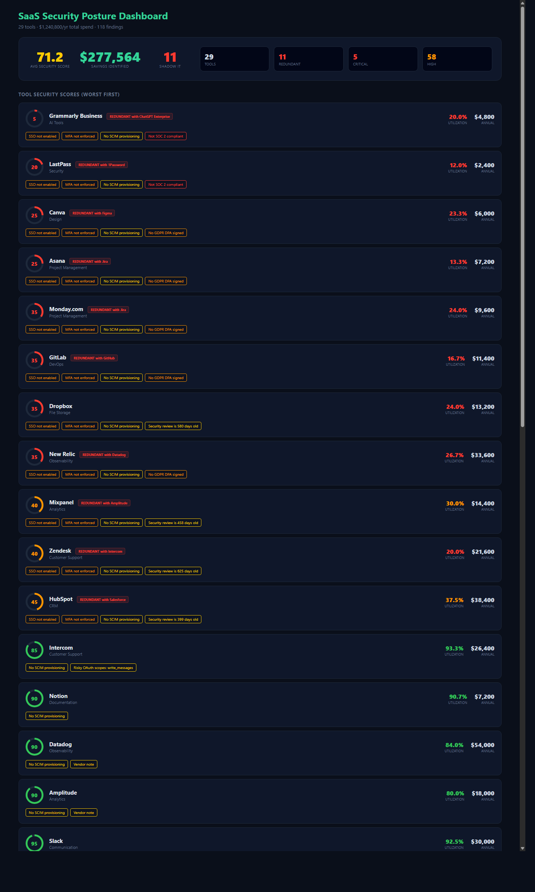

# SaaS Security Posture & Rationalization Dashboard

> **Full-stack SaaS inventory analysis -- shadow IT detection, redundant tool elimination, OAuth risk scoring, cost optimization.**
> A free, self-hosted alternative to Productiv, Zylo, and Torii for teams that want SaaS visibility without another SaaS subscription.

[](./LICENSE)
[](https://www.python.org/downloads/)
[-brightgreen.svg)]()

---

## What it does

Ingests your SaaS inventory and produces a security posture assessment with
actionable cost savings. Detects shadow IT (unapproved tools), flags redundant
subscriptions, scores OAuth integration risks, and calculates exactly how much
you can save by consolidating.

```
============================================================
  SaaS Security Posture & Rationalization Dashboard v1.0
============================================================
[*] Tools analyzed     : 29
[*] Total annual spend : $1,243,600
[*] Potential savings  : $277,200 (22.4%)
[*] Shadow IT detected : 11 unapproved tools
[*] Redundant tools    : 11 (consolidation candidates)
[*] Security findings  : 118

[CRITICAL] Shadow IT: Notion (unapproved, $14,400/yr, 45 users)
   No SSO integration, no DLP, data sovereignty unknown

[HIGH] Redundant: Asana + Monday.com + Trello
   3 project management tools, $72,000/yr combined
   Recommendation: consolidate to 1, save $48,000/yr

[HIGH] OAuth Risk: Zapier (scope: read+write, 200 integrations)
   Excessive permissions across 200 connected apps
```

---

## Screenshots (ran locally, zero setup)

**Terminal output** - exactly what you see on the command line:



**Interactive HTML dashboard** - opens in any browser, dark-mode, filterable:



Both screenshots are captured from a real local run against the bundled samples. Reproduce them with the quickstart commands below.

---

## Why you want this

| | **SaaS Security Posture** | Productiv | Zylo | Torii |
|---|---|---|---|---|
| **Price** | Free (MIT) | $$$$ | $$$$ | $$$ |
| **Runtime deps** | **None** -- pure stdlib | Cloud platform | Cloud platform | Cloud platform |
| **Install time** | `git clone && python analyzer.py` | Weeks | Weeks | Days |
| **Self-hosted** | Yes | No (SaaS) | No (SaaS) | No (SaaS) |
| **Shadow IT detection** | Yes | Yes | Yes | Yes |
| **Redundancy analysis** | Yes | Yes | Yes | Limited |
| **OAuth risk scoring** | Yes | Limited | No | Yes |
| **Cost optimization** | Yes ($$ savings) | Yes | Yes | Yes |

---

## 60-second quickstart

```bash
git clone https://github.com/CyberEnthusiastic/saas-security-posture.git
cd saas-security-posture
python analyzer.py
```

### One-command installer

```bash
./install.sh          # Linux / macOS / WSL / Git Bash
.\install.ps1         # Windows PowerShell
```

---

## Key findings (from bundled demo inventory)

| Category | Count | Details |
|----------|-------|---------|
| Tools analyzed | 29 | Full SaaS inventory scan |
| Shadow IT | 11 | Unapproved tools with no SSO/DLP |
| Redundant tools | 11 | Consolidation candidates across categories |
| Security findings | 118 | CRITICAL, HIGH, MEDIUM, LOW |
| Annual spend | $1.24M | Across all SaaS subscriptions |
| Savings identified | $277K | 22.4% reduction opportunity |

---

## How to run

```bash
# Analyze the bundled SaaS inventory
python analyzer.py

# Windows
python analyzer.py
start reports\saas_report.html

# macOS
python analyzer.py
open reports/saas_report.html

# Linux
python analyzer.py
xdg-open reports/saas_report.html
```

---

## How to uninstall

```bash
./uninstall.sh        # Linux / macOS / WSL / Git Bash
.\uninstall.ps1       # Windows PowerShell
```

---

## Project layout

```
saas-security-posture/
├── analyzer.py           # main engine -- inventory scan, shadow IT, redundancy, OAuth risk
├── report_generator.py   # HTML dashboard builder
├── data/
│   └── saas_inventory.json   # sample SaaS inventory (29 tools)
├── reports/              # generated HTML reports (gitignored)
├── .vscode/              # extensions.json, settings.json
├── Dockerfile            # containerized runs
├── install.sh            # installer (Linux/Mac/WSL)
├── install.ps1           # installer (Windows)
├── uninstall.sh          # uninstaller (Linux/Mac/WSL)
├── uninstall.ps1         # uninstaller (Windows)
├── requirements.txt      # empty -- pure stdlib
├── LICENSE               # MIT
├── NOTICE                # attribution
├── SECURITY.md           # vulnerability disclosure
└── CONTRIBUTING.md       # how to send PRs
```

---

## License

MIT. See [LICENSE](./LICENSE) and [NOTICE](./NOTICE).

---

Built by **[Mohith Vasamsetti (CyberEnthusiastic)](https://github.com/CyberEnthusiastic)** as part of the [AI Security Projects](https://github.com/CyberEnthusiastic?tab=repositories) suite.
